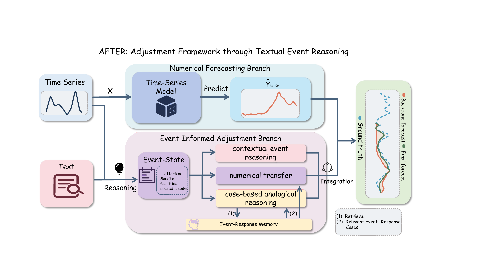

# AFTER: Adjustment Framework through Textual Event Reasoning

Official implementation of **AFTER**, an event-informed adjustment framework for multimodal time-series forecasting.

AFTER retains a numerical forecasting backbone and uses textual events to estimate an offset to its base forecast. It contains three components:

1. **History-Aware Event Reasoning (HAER)** identifies forecast-relevant events from the observed time series and textual context.
2. **Complementary Offset Estimation (COE)** combines contextual reasoning, retrieved event-response cases, and direct numerical transfer.
3. **Robust Offset Integration (ROI)** aggregates the candidate offsets with an element-wise median.

<p align="center">
  
</p>

## Repository structure

```text
data/                         Processed multimodal time-series datasets
data_provider/                Dataset loading and train/validation/test splits
exp/                          Training and evaluation pipeline
layers/                       Numerical forecasting layers
models/AFTER.py               Public AFTER model entry point
models/ContextOffset*.py      Core reasoning, memory, prompt, and cache implementation
prompt/                       HAER and offset-reasoning prompt templates
scripts/run_after.sh          Reproduction script
scripts/download_qwen_embedding.py
assets/                       Framework figure
run.py                        Main experiment entry point
```

`ContextOffset` is retained as the internal implementation name for compatibility with existing experiment artifacts. New experiments should use `--model AFTER`.

## Data

The reported evaluation uses nine domains derived from [Time-MMD](https://github.com/AdityaLab/Time-MMD):

```text
agriculture, climate, economy, energy, environment,
health, security, socialgood, traffic
```

The default prediction horizons are:

| Dataset | Input / label length | Prediction lengths |
|---|---:|---:|
| Energy, Health | 24 / 12 | 4, 8, 12, 24 |
| Environment | 48 / 24 | 7, 14, 30, 48 |
| Other domains | 24 / 12 | 6, 8, 10, 12 |

Please follow the original Time-MMD repository for dataset provenance and licensing.

## Environment

Python 3.10 or 3.11 is recommended.

1. Install a CUDA-compatible PyTorch build from [pytorch.org](https://pytorch.org/get-started/locally/).
2. Install the remaining dependencies:

```bash
pip install -r requirements-server.txt
```

Qwen3-Embedding requires `transformers>=4.51.0`; this constraint is included in `requirements-server.txt`.

## Download the retrieval model

AFTER uses `Qwen/Qwen3-Embedding-0.6B` to retrieve semantically related event states:

```bash
python scripts/download_qwen_embedding.py
```

The weights are downloaded to `llm/Qwen3-Embedding-0.6B/`. Model weights are excluded from Git by `.gitignore`.

## Configure the DeepSeek API

Never commit an API key. Copy the example environment file and replace the placeholder locally:

```bash
cp .env.example .env
```

```bash
DEEPSEEK_API_KEY=YOUR_API_KEY_HERE
DEEPSEEK_MODEL=deepseek-v4-flash
```

Alternatively, export the variables in the current shell:

```bash
export DEEPSEEK_API_KEY="YOUR_API_KEY_HERE"
export DEEPSEEK_MODEL="deepseek-v4-flash"
```

## Run AFTER

Run one dataset on physical GPU 0:

```bash
bash scripts/run_after.sh 0 energy
```

Run the full nine-domain grid sequentially on GPU 0:

```bash
bash scripts/run_after.sh 0 all
```

Run a comma-separated subset:

```bash
bash scripts/run_after.sh 0 agriculture,climate,traffic
```

Useful environment overrides:

```bash
BACKBONE=iTransformer
SEED=1
TRAIN_EPOCHS=10
BATCH_SIZE=32
API_CONCURRENCY=1
MEMORY_REBUILD=0
AFTER_OUTPUT_ROOT=./results/after_deepseek
```

The script automatically trains a missing numerical-backbone checkpoint and reuses an existing checkpoint otherwise. Event-response memories, API response caches, checkpoints, logs, and generated results are excluded from Git.

## Outputs

By default:

```text
checkpoints/          Numerical-backbone checkpoints
context_memory/       Training-set event-response memories
context_cache/        Cached LLM responses
results/              Predictions, offsets, records, and metrics
logs/                 Per-run summaries
```

Each result directory contains the final prediction, base prediction, estimated offset, metrics, and traceable context/retrieval records.

## Tests

```bash
pytest -q
```

## Citation

The paper citation will be added after publication. For anonymous review, please cite the accompanying submission.

## Acknowledgements

This codebase builds on [Time-Series-Library](https://github.com/thuml/Time-Series-Library), [MM-TSFlib](https://github.com/AdityaLab/MM-TSFlib), and [Time-MMD](https://github.com/AdityaLab/Time-MMD).

## License

The code is released under the MIT License. Third-party datasets and pretrained models remain subject to their respective licenses.
